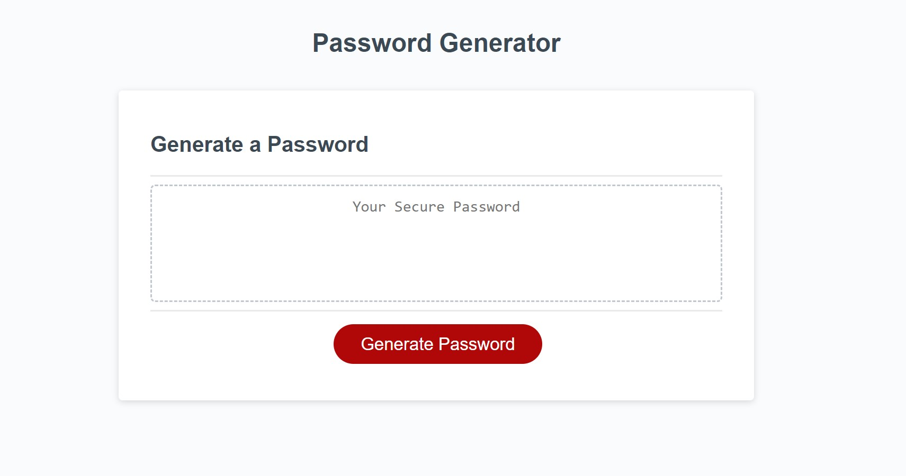

## Javascript Password Generator Homework Assignment

Name: Amy Kilgour 

Please click [https://kilgette.github.io/javascript-password-generator/](https://kilgette.github.io/javascript-password-generator/) 
to view the live version.  

Objective: Create a password generator that fulfills the provided criteria, 
utilizing what I've learned with JavaScript. 

Description: Modify starter code to build the logic into an app taht enables employees to generate 
random passwords. 

What I Learned: JavaScript logic, computational thinking as well as user prompt implementation
and utilization of for loops.   

